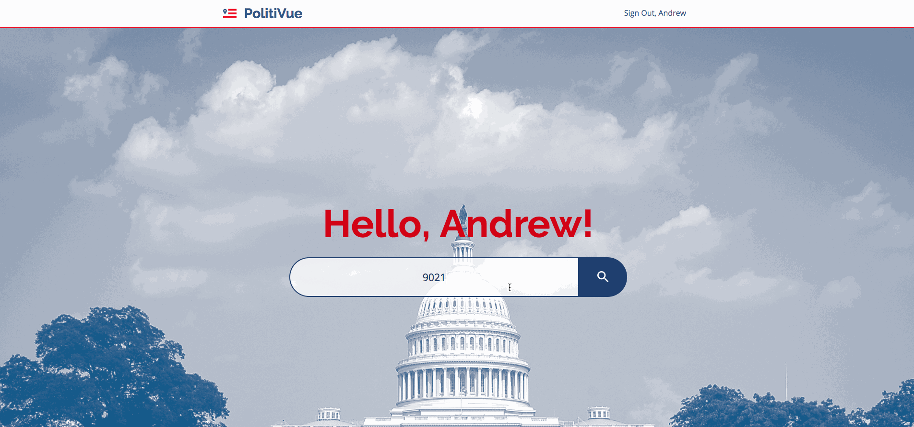

# PolitiVue


PolitiVue is a simple app that displays local and federal government officials, 
their party affiliation, contact information, social media accounts, and where 
their offices are located. 

- - - -

## What is the Purpose of This App?

We recognize that there are other websites and services out there that can 
return this same data, but we aimed to bring all of that data that is scattered 
around the internet and display it in a clear and simple way. 

## The App in Action

We have built a simple account creation tool that stores the user's name, email,
zip code, and a password that is validated and encrypted.

  

The only input required by the user is their zip code.



The list of government officials are the user's representatives for their area.
Clicking on an official displays more information about them on the right.


## Tools Used

Front-End Tools: 
* [Sketch 3](https://www.sketchapp.com/): used for wireframing and mockups
* [Vue.js](https://vuejs.org/v2/guide/): framework for building out the app
* [PostCSS](http://postcss.org/): tool for transforming CSS styles with JS plugins
* [Lost Grid](http://lostgrid.org/): PostCSS plugin to easily create layouts
* [SASS](https://sass-lang.com/): used to modularize CSS styles
* [Webpack](https://webpack.js.org/): used to bundle our modules and assets
* [Google Map API](https://developers.google.com/maps/): API used for the map component
* [Geocoder API](https://developers.google.com/maps/documentation/geocoding/intro): API used for displaying official's address

Back-End Tools:
* [Node.js](https://nodejs.org/en/): used for server-side scripting
* [Express](https://expressjs.com/): used as our server
* [MySQL](https://www.mysql.com/): used as our database
* [Sequelize](http://docs.sequelizejs.com/): used as our ORM
* [Jest](https://facebook.github.io/jest/): used for testing
* [Google Civic Information API](https://developers.google.com/civic-information/): API used for government official data

## Deployed Version

You can view a [deployed version here](https://politivue.herokuapp.com/)


## Installing

You can run this app locally by following these steps:

``` bash
# install dependencies
npm install

# serve with hot reload at localhost:3030
npm run dev

# build for production with minification
npm run production
```
